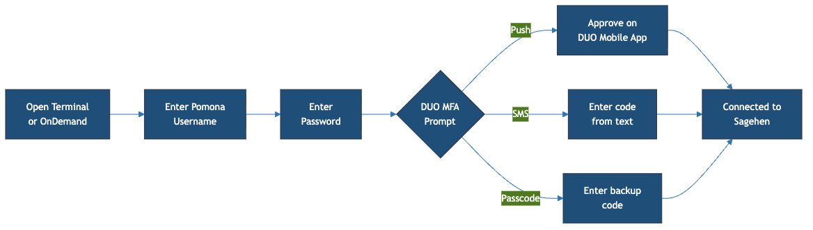
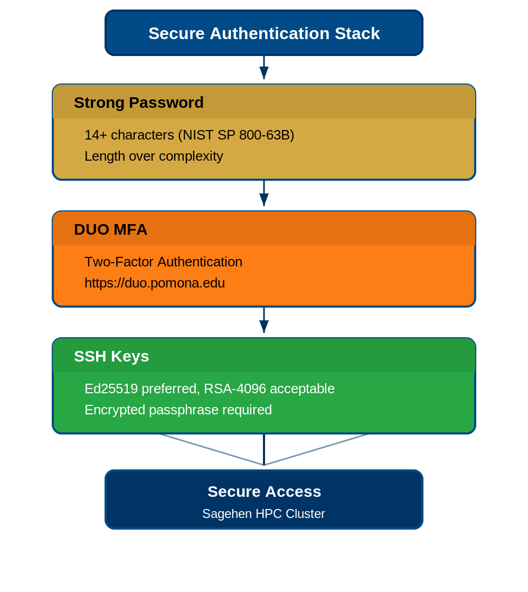

:::::::::::::::::::::::::::::::::::::: questions

- How do I connect to Sagehen using SSH?
- How do I set up SSH on my operating system?
- What is the OnDemand web portal?

::::::::::::::::::::::::::::::::::::::::::::::

::::::::::::::::::::::::::::::::::::: objectives

- Understand SSH (Secure Shell) and its role in remote access
- Set up SSH access on macOS, Linux, and Windows
- Know how to use the OnDemand web portal as an alternative
- Perform your first successful login to Sagehen

:::::::::::::::::::::::::::::::::::::::::::::::

## What is SSH?

**SSH** (Secure Shell) is a cryptographic network protocol that lets you securely connect to a remote computer and run commands as if you were sitting at that machine.

### Why SSH?

1. **Encryption**: All data between your computer and Sagehen is encrypted
2. **Authentication**: Confirms you are who you claim to be (via password + DUO)
3. **Remote execution**: You can run commands on Sagehen from your local machine
4. **Tunneling**: Advanced users can forward network ports for additional security

SSH is the standard protocol for accessing HPC clusters worldwide.

### SSH Connection Address

```
sagehen.hpc.pomona.edu
```

Your username is the part before @pomona.edu in your email. If your email is `alice@pomona.edu`, your username is `alice`.

## Setting Up SSH Access

### On macOS and Linux

macOS and Linux include SSH built-in. Open a terminal and connect:

**Step 1: Open Terminal**
- macOS: Applications > Utilities > Terminal (or Cmd+Space, type "Terminal")
- Linux: Ctrl+Alt+T (most distributions)

**Step 2: Connect to Sagehen**
```bash
ssh <myusername>@sagehen.hpc.pomona.edu
```

**Step 3: Accept the Host Key**

On your first connection, you'll see a prompt asking you to verify the host. Type `yes` and press Enter.

### On Windows 10/11 with PowerShell

```powershell
ssh <myusername>@sagehen.hpc.pomona.edu
```

### On Windows with PuTTY

1. Download PuTTY from https://www.putty.org/
2. In "Host Name", enter: `sagehen.hpc.pomona.edu`
3. Leave "Port" as 22
4. Click "Open"
5. Accept the host key and enter your username

### On Windows with WSL

WSL provides a native Linux environment. After installing (`wsl --install` in PowerShell as Administrator), use the standard SSH command.

::::::::::::::::::::::::::::::::::::::: callout

## Choosing an SSH Client

- **macOS/Linux users**: Use the built-in Terminal application
- **Windows 10+ users**: Use PowerShell (simplest) or WSL (most Linux-like)
- **Prefer graphical interface**: Use PuTTY
- **Advanced users**: Use SSH config files or terminal multiplexers (tmux, screen)

:::::::::::::::::::::::::::::::::::::::::::::::

## DUO Two-Factor Authentication

When you connect, Sagehen requires **DUO authentication** at https://duo.pomona.edu.

{alt='Flow diagram of connecting to Sagehen. Open Terminal or OnDemand, enter Pomona username, enter password, then the DUO MFA prompt offers three paths: Push approves on the Duo Mobile app, SMS enters a code from a text message, and Passcode enters a backup code. All three paths lead to Connected to Sagehen.'}

After entering your Pomona password, you'll see a DUO prompt:

- **Option 1: Push** (recommended) -- approve the notification on your phone
- **Option 2: SMS** -- enter the 6-digit code texted to you
- **Option 3: Backup Code** -- enter a pre-generated backup code

{alt='A PowerShell window running ssh to sagehen.hpc.pomona.edu. After the password prompt, a Duo two-factor menu offers Duo Push, a phone call, or SMS passcodes; option 1 is chosen and login succeeds. The commands whoami and hostname then return the username and sagehen.hpc.pomona.edu.'}

If DUO fails, contact Pomona IT Help Desk: (909) 621-8061 or servicedesk@pomona.edu.

## The OnDemand Web Portal

If you prefer not to use SSH, access Sagehen through a web browser:

**URL:** [https://ondemand.hpc.pomona.edu/](https://ondemand.hpc.pomona.edu/)

You'll sign in with your Pomona credentials (the same Microsoft sign-in page used for other campus services):

{alt='Pomona College single sign-on page with a Sign in box prompting for username at pomona.edu, a Next button, and a campus pathway with trees in the background.'}

After signing in and completing DUO, you'll land on the OnDemand dashboard:

{alt='Pomona College OnDemand dashboard showing pinned apps organized into Clusters with Pomona Cluster Shell Access and System Status, Files with Home Directory, and a row of Interactive Apps, beneath menus for Apps, Files, Jobs, Clusters, and Interactive Apps.'}

### Advantages of OnDemand

- No SSH knowledge required
- Graphical file browser and text editor
- Interactive desktop sessions (VNC)
- Jupyter Notebook access
- Drag-and-drop file transfer

Most advanced users use SSH, but OnDemand is perfect for getting started.

## Logging Out

When you're done, disconnect from Sagehen:

```bash
exit
```

Or press Ctrl+D.

::::::::::::::::::::::::::::::::::::::: callout

## Important Security Notes

1. **Never share your password** with anyone, including IT staff
2. **Close your connection** when done; don't leave it running all day
3. **SSH keys**: Ed25519 is recommended; RSA-4096 is acceptable
4. **DUO is required**: You cannot bypass two-factor authentication

{alt='Diagram of the secure authentication stack. Three stacked layers: Strong Password with 14 or more characters per NIST SP 800-63B and length over complexity; DUO MFA two-factor authentication at duo.pomona.edu; and SSH Keys with Ed25519 preferred, RSA-4096 acceptable, and an encrypted passphrase required. The layers converge to Secure Access to the Sagehen HPC cluster.'}

:::::::::::::::::::::::::::::::::::::::::::::::

::::::::::::::::::::::::::::::::::::: challenge

## Challenge 1: Your First SSH Connection

Connect to Sagehen and verify your environment.

**Steps**:

1. Open your terminal (or PuTTY)
2. Run: `ssh <myusername>@sagehen.hpc.pomona.edu`
3. Enter your Pomona password and complete DUO authentication
4. Verify with:

   ```bash
   whoami
   hostname
   pwd
   ```

You should see your username, `sagehen`, and `/rhome/<myusername>`.

:::::::::::::::::::::::: solution

## Solution

If you see `[<myusername>@sagehen ~]$` and the verification commands produce correct output, you're connected.

Common errors:

- **"Permission denied"**: verify your username (not email) and password
- **"DUO authentication failed"**: ensure Duo Mobile is updated; try SMS
- **"Connection timeout"**: check internet; try a different network

:::::::::::::::::::::::::::::::::::::
:::::::::::::::::::::::::::::::::::::

:::::::::::::::::::::::::::::::::::::::: keypoints

- SSH (Secure Shell) is the standard for securely connecting to remote computers
- macOS and Linux include SSH built-in; Windows users can use PowerShell or PuTTY
- DUO two-factor authentication is required; push notification is fastest
- OnDemand (https://ondemand.hpc.pomona.edu/) provides a graphical alternative to SSH
- Always log out when done with `exit` or Ctrl+D

::::::::::::::::::::::::::::::::::::::::::::::

<!-- highlight <labname>/<myusername> placeholders in code blocks; remove if the varnish theme handles this natively -->
<script>(function(){var CSS='.sh-placeholder{color:#c2410c;font-weight:700}[data-bs-theme="dark"] .sh-placeholder,html.dark .sh-placeholder{color:#fdba74}@media (prefers-color-scheme: dark){[data-bs-theme="auto"] .sh-placeholder{color:#fdba74}}';var RX=/<labname>|<myusername>/g;function firstMatch(el){var w=document.createTreeWalker(el,NodeFilter.SHOW_TEXT,null),nodes=[],full='';while(w.nextNode()){nodes.push({n:w.currentNode,s:full.length});full+=w.currentNode.nodeValue;}RX.lastIndex=0;var m;while((m=RX.exec(full))){var s=m.index,e=s+m[0].length,inSpan=false,parts=[];for(var j=0;j<nodes.length;j++){var ns=nodes[j].s,ne=ns+nodes[j].n.nodeValue.length;if(ne<=s||ns>=e)continue;parts.push({node:nodes[j].n,a:Math.max(s-ns,0),b:Math.min(e-ns,nodes[j].n.nodeValue.length)});var p=nodes[j].n.parentNode;while(p&&p!==el){if(p.classList&&p.classList.contains('sh-placeholder')){inSpan=true;break;}p=p.parentNode;}}if(!inSpan&&parts.length)return parts;}return null;}function wrapParts(parts){for(var i=parts.length-1;i>=0;i--){var t=parts[i].node,txt=t.nodeValue,a=parts[i].a,b=parts[i].b;var span=document.createElement('span');span.className='sh-placeholder';span.textContent=txt.slice(a,b);var f=document.createDocumentFragment();if(a>0)f.appendChild(document.createTextNode(txt.slice(0,a)));f.appendChild(span);if(b<txt.length)f.appendChild(document.createTextNode(txt.slice(b)));t.parentNode.replaceChild(f,t);}}function run(){var st=document.createElement('style');st.textContent=CSS;document.head.appendChild(st);document.querySelectorAll('pre,code').forEach(function(el){var guard=0,parts;while((parts=firstMatch(el))&&guard++<500){wrapParts(parts);}});}if(document.readyState==='loading'){document.addEventListener('DOMContentLoaded',run);}else{run();}})();</script>
