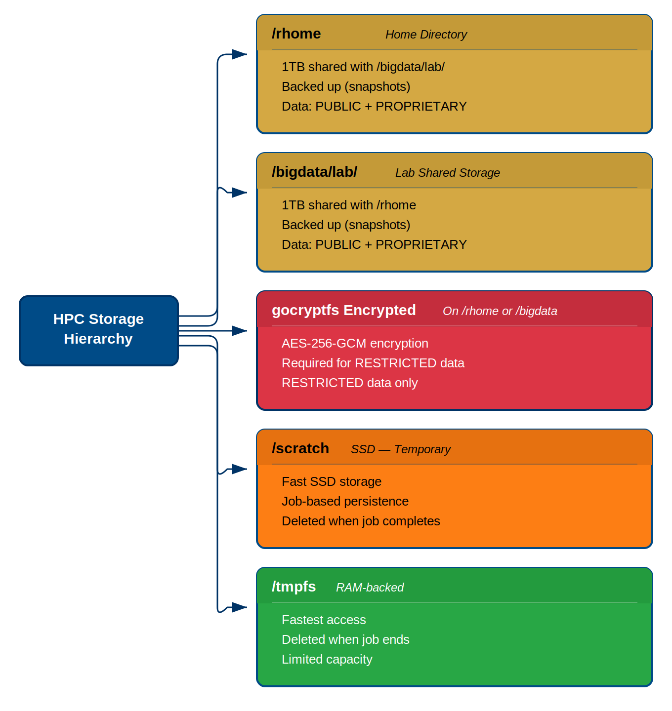

:::::::::::::::::::::::::::::::::::::: questions

- How is the Sagehen HPC filesystem organized?
- What are the different storage spaces and what are they for?
- How do I check my storage quota?

::::::::::::::::::::::::::::::::::::::::::::::

::::::::::::::::::::::::::::::::::::: objectives

- Understand the different storage locations on Sagehen
- Distinguish between persistent and temporary storage
- Check storage quotas and usage
- Navigate the filesystem using fundamental Linux commands

:::::::::::::::::::::::::::::::::::::::::::::::

## Sagehen HPC's Storage Architecture

Sagehen uses a BeeGFS parallel filesystem connected via 100 Gb Infiniband. It has multiple storage systems, each designed for specific purposes.

{alt='Diagram of the HPC storage hierarchy with five storage types. /rhome home directory and /bigdata/lab lab shared storage share a 1 TB quota, are backed up, and hold PUBLIC and PROPRIETARY data. gocryptfs encrypted storage on /rhome or /bigdata uses AES-256-GCM encryption and is required for RESTRICTED data. /scratch is fast temporary SSD storage deleted when the job completes. /tmpfs is RAM-backed, fastest, deleted when the job ends, and limited in capacity.'}

### Storage Location Overview

| Location | Quota | Backup | Persistence | Speed | Use Case |
|----------|-------|--------|-------------|-------|----------|
| `/rhome/<myusername>` | ~100 GB | Daily | Persistent | Medium | Code, config, small results |
| `/bigdata/lab/<labname>` | 1 TB/lab | Daily | Persistent | Medium | Lab datasets, shared files |
| `/scratch/...` | None | No | Temporary | Fast (SSD) | Large intermediate files |
| `/tmpfs` | ~1 GB/job | No | Temporary | Fastest (RAM) | Ultra-fast I/O during jobs |

Note: `/rhome` and `/bigdata` share a combined 1 TB lab quota.

### Your Home Directory: `/rhome/<myusername>`

This is your personal space on Sagehen.

- **Size**: Approximately 100 GB
- **Backup**: Yes, daily backups
- **When to use**: Source code, configuration files, small result files
- **When NOT to use**: Large datasets, temporary files from jobs

```bash
# Navigate to your home directory
cd ~

# See where you are
pwd

# List files with details
ls -lah
```

::::::::::::::::::::::::::::::::::::::: callout

## The Tilde Shortcut

In bash, `~` always refers to your home directory:

```bash
cd ~              # Go to home
cd ~/workshop-0   # Go to workshop-0 in home
cp file.txt ~     # Copy file to home
```

:::::::::::::::::::::::::::::::::::::::::::::::

### Lab Storage: `/bigdata/lab/<labname>`

If you're part of a research lab, you may have access to shared lab storage.

- **Size**: 1 TB per lab group (shared among all lab members)
- **Backup**: Yes, daily backups
- **When to use**: Large datasets, results shared with collaborators

```bash
# Check if you have lab storage
ls /bigdata/lab
```

If you don't see your lab listed, contact its-hpc@pomona.edu.

### Scratch Storage

High-speed temporary SSD storage designed for jobs that need fast I/O.

- **Location**: `/scratch/$SLURM_JOB_USER/$SLURM_JOB_ID`
- **Lifetime**: Deleted when job completes (non-persistent)
- **When to use**: Large temporary files created during job execution

### RAM Disk: /tmpfs

Ultra-fast memory-backed storage.

- **Lifetime**: Deleted when job ends
- **Size**: Limited (~1-2 GB per job)
- **When to use**: Only for jobs with extreme I/O needs

## Essential Navigation Commands

```bash
# Print working directory (where am I?)
pwd

# List files in current directory
ls

# List with human-readable sizes and hidden files
ls -lah

# Change to home directory
cd

# Change to a specific directory
cd /rhome/<myusername>

# Change to previous directory
cd -

# Change up one level
cd ..
```

## Checking Your Storage Usage

::::::::::::::::::::::::::::::::::::::: callout

## BeeGFS Quota Check

On Sagehen's BeeGFS filesystem, the standard `du` command does not work correctly for quota checks. Use the provided script instead:

```bash
quota_check.sh
```

This will display your current usage against your quota.

{alt='Terminal output of quota_check.sh with two tables. The GROUP Quota table shows a lab group using about 508 GiB of a 931 GiB storage pool with 1.1 million inodes. The User Quota table shows an individual user with a small amount used and no hard per-user limit shown. Both tables include a refresh timestamp.'}

:::::::::::::::::::::::::::::::::::::::::::::::

If you're approaching your quota, consider:

1. Compressing old results: `tar czf archive.tar.gz data/`
2. Removing unnecessary files
3. Moving data to lab storage: `mv results /bigdata/lab/<labname>/`
4. Contacting its-hpc@pomona.edu for additional storage

::::::::::::::::::::::::::::::::::::: challenge

## Challenge 1: Explore Sagehen HPC's Storage

Connect to Sagehen and explore the filesystem.

**Steps**:

1. Check your home directory: `cd ~ && pwd`
2. List its contents: `ls -lah`
3. Check for lab storage: `ls /bigdata/lab`
4. Run the quota check: `quota_check.sh`

**Questions**:

- What is the full path to your home directory?
- Do you have access to lab storage?
- How much of your quota is used?

:::::::::::::::::::::::: solution

## Solution

- Your home directory should be `/rhome/<myusername>`
- Lab storage appears under `/bigdata/lab/` if your lab has been set up
- `quota_check.sh` shows your current usage vs. your quota limit

If you're using close to 100 GB, consider cleaning up old files. Contact its-hpc@pomona.edu if you need more space.

:::::::::::::::::::::::::::::::::::::
:::::::::::::::::::::::::::::::::::::

:::::::::::::::::::::::::::::::::::::::: keypoints

- Sagehen uses BeeGFS over 100 Gb Infiniband for its parallel filesystem
- Your home directory `/rhome/<myusername>` is persistent and backed up (~100 GB)
- Lab storage `/bigdata/lab/<labname>` provides 1 TB shared among lab members
- Scratch (`/scratch`) is SSD-based and deleted when your job completes
- RAM disk (`/tmpfs`) is the fastest but most ephemeral storage
- Use `quota_check.sh` to check your storage usage (not `du`)
- Essential navigation: `pwd`, `ls`, `cd`, `cd ~`, `cd ..`

::::::::::::::::::::::::::::::::::::::::::::::

<!-- highlight <labname>/<myusername> placeholders in code blocks; remove if the varnish theme handles this natively -->
<script>(function(){var CSS='.sh-placeholder{color:#c2410c;font-weight:700}[data-bs-theme="dark"] .sh-placeholder,html.dark .sh-placeholder{color:#fdba74}@media (prefers-color-scheme: dark){[data-bs-theme="auto"] .sh-placeholder{color:#fdba74}}';var RX=/<labname>|<myusername>/g;function firstMatch(el){var w=document.createTreeWalker(el,NodeFilter.SHOW_TEXT,null),nodes=[],full='';while(w.nextNode()){nodes.push({n:w.currentNode,s:full.length});full+=w.currentNode.nodeValue;}RX.lastIndex=0;var m;while((m=RX.exec(full))){var s=m.index,e=s+m[0].length,inSpan=false,parts=[];for(var j=0;j<nodes.length;j++){var ns=nodes[j].s,ne=ns+nodes[j].n.nodeValue.length;if(ne<=s||ns>=e)continue;parts.push({node:nodes[j].n,a:Math.max(s-ns,0),b:Math.min(e-ns,nodes[j].n.nodeValue.length)});var p=nodes[j].n.parentNode;while(p&&p!==el){if(p.classList&&p.classList.contains('sh-placeholder')){inSpan=true;break;}p=p.parentNode;}}if(!inSpan&&parts.length)return parts;}return null;}function wrapParts(parts){for(var i=parts.length-1;i>=0;i--){var t=parts[i].node,txt=t.nodeValue,a=parts[i].a,b=parts[i].b;var span=document.createElement('span');span.className='sh-placeholder';span.textContent=txt.slice(a,b);var f=document.createDocumentFragment();if(a>0)f.appendChild(document.createTextNode(txt.slice(0,a)));f.appendChild(span);if(b<txt.length)f.appendChild(document.createTextNode(txt.slice(b)));t.parentNode.replaceChild(f,t);}}function run(){var st=document.createElement('style');st.textContent=CSS;document.head.appendChild(st);document.querySelectorAll('pre,code').forEach(function(el){var guard=0,parts;while((parts=firstMatch(el))&&guard++<500){wrapParts(parts);}});}if(document.readyState==='loading'){document.addEventListener('DOMContentLoaded',run);}else{run();}})();</script>
