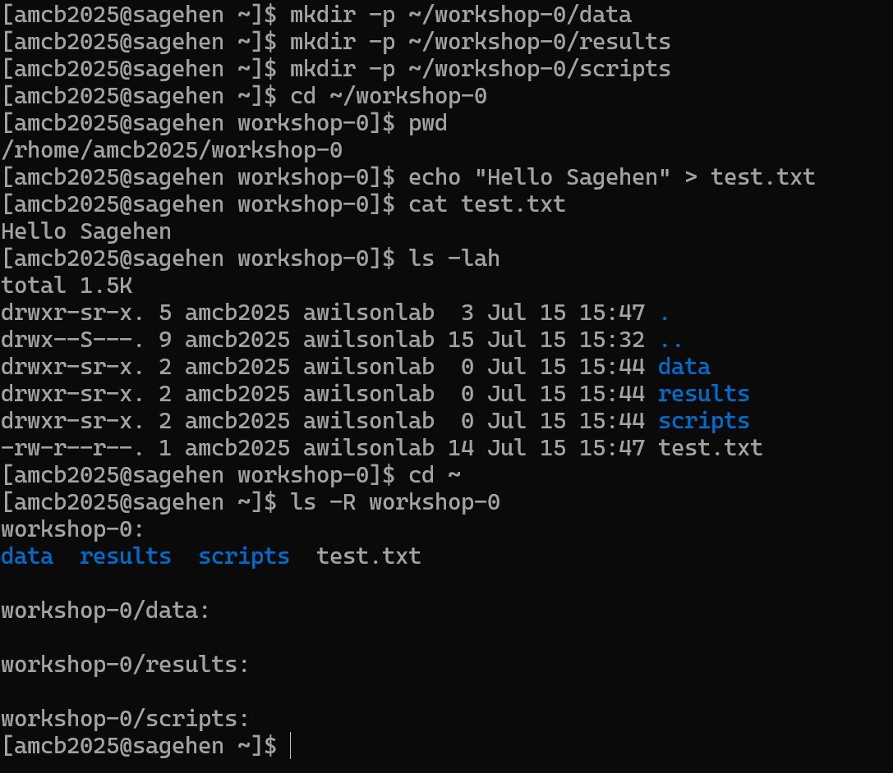

:::::::::::::::::::::::::::::::::::::: questions

- How do I create, copy, move, and delete files?
- How should I organize my work on Sagehen?
- What are file permissions and how do I change them?

::::::::::::::::::::::::::::::::::::::::::::::

::::::::::::::::::::::::::::::::::::: objectives

- Create and manage files and directories on Sagehen
- Organize research work with a logical directory structure
- Understand file permissions and access controls
- Share files securely with collaborators

:::::::::::::::::::::::::::::::::::::::::::::::

## Creating and Removing Files and Directories

```bash
# Create a directory
mkdir mydir

# Create nested directories
mkdir -p data/raw/input

# Create an empty file
touch myfile.txt

# Remove an empty directory
rmdir mydir

# Remove a file (be careful!)
rm myfile.txt

# Remove a directory and everything in it (DANGEROUS!)
rm -rf mydir
```

::::::::::::::::::::::::::::::::::::::: callout

## Never Use `rm -rf` Casually!

The command `rm -rf directory` recursively deletes everything permanently; there is no trash or undo. Always list files first to confirm:

```bash
# List files FIRST to confirm what you're deleting
ls -la mydir

# Then delete
rm -rf mydir

# Or use interactive mode (walks the tree and asks about every single file before deleting, reply y or n (yes or not))
rm -ri mydir
```

{alt='A short terminal transcript on Sagehen. mkdir creates a directory named mydir, ls -la shows it is empty, and rm -ri prompts remove directory 'mydir'? before deleting it after the user types y.'}

:::::::::::::::::::::::::::::::::::::::::::::::

## Working with Files

```bash
# View file contents
cat myfile.txt

# View beginning of file (first 10 lines)
head myfile.txt

# View end of file (last 10 lines)
tail myfile.txt

# Search for text in a file
grep "pattern" myfile.txt

# Count lines in a file
wc -l myfile.txt

# Search for files by name
find . -name "*.txt"

# Find recently modified files
find . -mtime -7
```

## Organizing Your Work

### Recommended Directory Structure

Create a logical organization in your home directory:

```bash
cd ~
mkdir -p projects/project1
mkdir -p projects/project2
mkdir -p code
mkdir -p data
mkdir -p results
```

Example project structure:
```
/rhome/<myusername>/
├── projects/
│   ├── research-1/
│   │   ├── code/
│   │   ├── data/
│   │   └── results/
│   └── research-2/
├── code/
├── scripts/
└── workshop-0/
```

## File Permissions

Every file and directory has permissions controlling who can read, write, and execute it.

### Understanding Permission Output

```bash
ls -l myfile.txt
```

Output example:
```
-rw-r--r-- 1 username groupname 1024 Mar 31 10:30 myfile.txt
```

- `-` = regular file (`d` = directory)
- `rw-` = owner can read and write
- `r--` = group can only read
- `r--` = others can only read

### Changing Permissions

```bash
# Make a file executable
chmod +x script.sh

# Make a file read-only
chmod -w myfile.txt

# Allow group to write
chmod g+w myfile.txt

# Common numeric patterns
chmod 644 myfile.txt  # rw-r--r--
chmod 755 script.sh   # rwxr-xr-x
```

{alt='Terminal transcript in which chmod minus w makes a file read-only, chmod g minus r removes group read, and chmod o minus r removes other read. After each command, ls -l shows the permission string shrinking from r--r--r-- down to owner-only.'}

::::::::::::::::::::::::::::::::::::::: callout

## Sharing Files with Collaborators

To share results with other Pomona researchers:

1. Put files in `/bigdata/lab/<labname>` if it's lab work
2. Or give them read access to files in your home directory:
   ```bash
   chmod g+rx ~
   chmod g+r ~/results/myfile.txt
   ```
3. Share the path with collaborators

:::::::::::::::::::::::::::::::::::::::::::::::

::::::::::::::::::::::::::::::::::::: challenge

## Challenge 1: Create a Project Structure

Create a directory structure for this workshop and practice file operations.

**Steps**:

1. Create directories:
   ```bash
   mkdir -p ~/workshop-0/data
   mkdir -p ~/workshop-0/results
   mkdir -p ~/workshop-0/scripts
   ```
2. Navigate into the directory: `cd ~/workshop-0`
3. Check your location: `pwd`
4. Create a test file: `echo "Hello Sagehen" > test.txt`
5. View it: `cat test.txt`
6. List everything: `ls -lah`
7. Return home: `cd ~`
8. List recursively: `ls -R workshop-0`

**Questions**:

- What path does `pwd` show when in workshop-0?
- How many directories did you create?

:::::::::::::::::::::::: solution

## Solution

`pwd` should show `/rhome/<myusername>/workshop-0`.

You created 4 directories total: `workshop-0` (main) plus `data`, `results`, `scripts` (subdirectories).

The command `ls -R workshop-0` shows the entire tree, including the `test.txt` file you created.

{alt='A terminal transcript creating the data, results, and scripts directories under workshop-0 with mkdir -p, with pwd printing the home workshop-0 path. A test.txt containing Hello Sagehen is created and displayed, ls -lah lists the contents, and ls -R shows the recursive tree.'}

:::::::::::::::::::::::::::::::::::::
:::::::::::::::::::::::::::::::::::::

:::::::::::::::::::::::::::::::::::::::: keypoints

- Use `mkdir -p` to create nested directories in one command
- Be extremely careful with `rm -rf`; always list contents first
- Organize work into logical directories: projects, code, data, results
- File permissions control read, write, and execute access for owner, group, and others
- Use `chmod` to change permissions; share files via `/bigdata` or by adjusting group permissions

::::::::::::::::::::::::::::::::::::::::::::::

<!-- highlight <labname>/<myusername> placeholders in code blocks; remove if the varnish theme handles this natively -->
<script>(function(){var CSS='.sh-placeholder{color:#c2410c;font-weight:700}[data-bs-theme="dark"] .sh-placeholder,html.dark .sh-placeholder{color:#fdba74}@media (prefers-color-scheme: dark){[data-bs-theme="auto"] .sh-placeholder{color:#fdba74}}';var RX=/<labname>|<myusername>/g;function firstMatch(el){var w=document.createTreeWalker(el,NodeFilter.SHOW_TEXT,null),nodes=[],full='';while(w.nextNode()){nodes.push({n:w.currentNode,s:full.length});full+=w.currentNode.nodeValue;}RX.lastIndex=0;var m;while((m=RX.exec(full))){var s=m.index,e=s+m[0].length,inSpan=false,parts=[];for(var j=0;j<nodes.length;j++){var ns=nodes[j].s,ne=ns+nodes[j].n.nodeValue.length;if(ne<=s||ns>=e)continue;parts.push({node:nodes[j].n,a:Math.max(s-ns,0),b:Math.min(e-ns,nodes[j].n.nodeValue.length)});var p=nodes[j].n.parentNode;while(p&&p!==el){if(p.classList&&p.classList.contains('sh-placeholder')){inSpan=true;break;}p=p.parentNode;}}if(!inSpan&&parts.length)return parts;}return null;}function wrapParts(parts){for(var i=parts.length-1;i>=0;i--){var t=parts[i].node,txt=t.nodeValue,a=parts[i].a,b=parts[i].b;var span=document.createElement('span');span.className='sh-placeholder';span.textContent=txt.slice(a,b);var f=document.createDocumentFragment();if(a>0)f.appendChild(document.createTextNode(txt.slice(0,a)));f.appendChild(span);if(b<txt.length)f.appendChild(document.createTextNode(txt.slice(b)));t.parentNode.replaceChild(f,t);}}function run(){var st=document.createElement('style');st.textContent=CSS;document.head.appendChild(st);document.querySelectorAll('pre,code').forEach(function(el){var guard=0,parts;while((parts=firstMatch(el))&&guard++<500){wrapParts(parts);}});}if(document.readyState==='loading'){document.addEventListener('DOMContentLoaded',run);}else{run();}})();</script>
