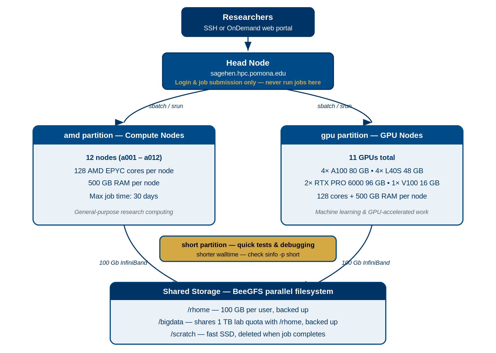

:::::::::::::::::::::::::::::::::::::: questions

- What are partitions and why does Sagehen have three?
- What hardware is in each partition?
- How do I view cluster status?

::::::::::::::::::::::::::::::::::::::::::::::

::::::::::::::::::::::::::::::::::::: objectives

- Understand the concept of partitions in HPC clusters
- Learn Sagehen's specific hardware specifications for each partition
- Use `sinfo` to query cluster status

:::::::::::::::::::::::::::::::::::::::::::::::

## What are Partitions?

A **partition** in SLURM is a logical grouping of compute nodes with shared characteristics. Sagehen uses partitions to organize nodes by hardware type, time limits, and priority.

Think of partitions like different sections of a library: fiction, non-fiction, reference. Each section is organized for its purpose.

{alt='Diagram of the Sagehen HPC cluster. Researchers connect via SSH or the OnDemand web portal to the head node, which dispatches jobs via sbatch or srun to the amd partition of 12 compute nodes with 128 AMD EPYC cores and 500 GB RAM each, or the gpu partition with 10 GPUs total. A short partition serves quick tests and debugging with a shorter walltime. All nodes share BeeGFS storage over 100 Gb InfiniBand.'}

### The "amd" Partition (Standard Compute)

The primary general-purpose partition for most research.

- **12 compute nodes**
- **Cores per node**: 128 (AMD EPYC processors)
- **Memory per node**: 500 GB
- **Interconnect**: 100 Gb Infiniband
- **Maximum job duration**: 720 hours (30 days)

**When to use**: Most research computations, data processing, simulations, first-time job submissions.

### The "gpu" Partition (GPU Acceleration)

For research requiring GPU acceleration.

- **Multiple GPU-equipped nodes**
- **CPUs**: 128 cores per node, 500 GB RAM
- **GPUs**:

| GPU Type | Count | GPU Memory | Strength |
|----------|-------|------------|----------|
| NVIDIA A100 | 4 | 80 GB each | Excellent for training |
| NVIDIA L40S | 4 | 48 GB each | Tensor-optimized / inference |
| NVIDIA RTX PRO 6000 | 2 | 96 GB each | Largest memory on the cluster (Blackwell) |

That's **10 GPUs in total** across the gpu partition.

- **Maximum job duration**: 720 hours (30 days)

**When to use**: CUDA/cuDNN code, deep learning training, GPU-accelerated molecular dynamics.

::::::::::::::::::::::::::::::::::::::: callout

## GPU Allocation Matters

Request only the GPUs you need:

- Deep learning: Usually 1-2 GPUs per job
- Multi-GPU training: 2-4 GPUs (if your code supports it)
- Standard molecular dynamics: 1 GPU

Each GPU reserved limits availability for others. Be considerate!

:::::::::::::::::::::::::::::::::::::::::::::::

### The "short" Partition (Quick Jobs and Debugging)

For quick test jobs, debugging job scripts, and rapid prototyping.

- **Shorter maximum walltime** than `amd` and `gpu` (verify with `sinfo -p short`)
- Higher priority for short-duration work
- Useful for sanity-checking software and submission scripts before running long jobs

**When to use**: Debugging job scripts, quick test runs, single-task interactive debugging, and any work that finishes within the `short` partition's walltime limit.

## Viewing Cluster Status with sinfo

```bash
# See all partitions
sinfo

# More detailed output
sinfo -l

# Show only a specific partition
sinfo -p amd

# Show all nodes and their state
sinfo -N
```

Example output:
```
PARTITION  AVAIL  TIMELIMIT   NODES  STATE
amd           up 30-00:00:00     12  alloc
gpu           up 30-00:00:00      4  alloc
short         up    2:00:00      4  idle
```

(The exact `short` partition walltime limit may differ — always check `sinfo -p short` for current values.)

- `AVAIL`: Is the partition available (up/down)?
- `TIMELIMIT`: Maximum job duration
- `STATE`: Current state (alloc=some allocated, idle=free, down=unavailable)

::::::::::::::::::::::::::::::::::::: challenge

## Challenge 1: Exploring Sagehen's Partitions

Query the cluster to understand its configuration.

**Steps**:

1. View partition information: `sinfo -l`
2. View node details: `sinfo -N -l`
3. Check the head node CPU: `lscpu | head -20`

**Questions**:

- How many nodes are in the "amd" partition?
- What is the maximum walltime for the amd partition?
- How many cores does a compute node have?

:::::::::::::::::::::::: solution

## Solution

- amd partition: 12 nodes
- amd partition maximum walltime: 720 hours (30 days)
- Each compute node: 128 cores

All standard compute nodes on Sagehen have identical configurations.

{alt='Terminal output of two sinfo commands on Sagehen. The partition view lists amd and gpu with a 30-day time limit and short with a 2-hour limit. The node view lists a001 through a012 with 128 CPUs and roughly 512 GB of memory each, plus five gpu nodes, one of which is down.'}

{alt='Output of lscpu piped to head, reporting x86_64 architecture, 64 online CPUs from two sockets of 16 cores with two threads per core, vendor AuthenticAMD, and the model name AMD EPYC 7313 16-Core Processor.'}

:::::::::::::::::::::::::::::::::::::
:::::::::::::::::::::::::::::::::::::

:::::::::::::::::::::::::::::::::::::::: keypoints

- Partitions group nodes by hardware type and enforce time/resource limits
- Sagehen has three partitions: `amd` (general purpose), `gpu` (GPU-accelerated), and `short` (quick / test / debug jobs with a shorter walltime)
- Each compute node has 128 AMD EPYC cores and 500 GB RAM
- GPU partition offers 10 GPUs: A100, L40S, and RTX PRO 6000
- Use `sinfo` to check partition status, node states, and available resources
- Maximum job time: 720 hours (30 days) on `amd` and `gpu`; check `sinfo -p short` for the `short` partition limit

::::::::::::::::::::::::::::::::::::::::::::::
