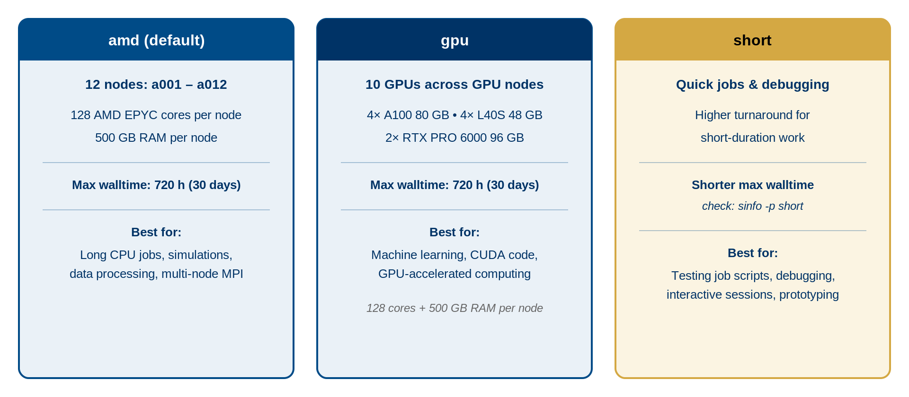

:::::::::::::::::::::::::::::::::::::: questions

- What are nodes and cores?
- How does SLURM allocate resources?
- How do I choose the right partition for my job?
- What are the resource limits?

::::::::::::::::::::::::::::::::::::::::::::::

::::::::::::::::::::::::::::::::::::: objectives

- Distinguish between CPU cores, sockets, and nodes
- Understand how SLURM allocates nodes to jobs
- Match job requirements to the appropriate partition
- Know resource limits and how to request increases

:::::::::::::::::::::::::::::::::::::::::::::::

## Nodes and Cores: The Hierarchy

### Understanding the Terminology

- **Node**: A complete computer with its own memory, storage, and processors
- **Socket**: A physical CPU processor installed in a node
- **Core**: An individual processing unit within a socket (128 per node on Sagehen HPC)
- **Thread**: A logical processing unit (some CPUs support hyperthreading)

```
Sagehen (the cluster)
├── amd partition (12 nodes)
│   └── Each: 128 cores, 500 GB RAM
├── gpu partition (multiple nodes)
│   └── Each: 128 cores, 500 GB RAM + NVIDIA GPUs
└── short partition (quick / test / debug jobs)
    └── Shorter walltime limit; check `sinfo -p short`
```

## How SLURM Allocates Resources

When you submit a job, SLURM:

1. **Finds available nodes** matching your partition and resource request
2. **Selects the best fit** (minimizing wasted resources)
3. **Allocates entire cores** to your job (no fractional cores)
4. **Locks the resources** until your job completes

### Example Allocations

**32-core job**: SLURM allocates 32 cores on one node; the remaining 96 cores on that node are available for other jobs.

**256-core job (2 nodes)**: SLURM allocates 128 cores on node 1 and 128 cores on node 2. Your job uses both nodes together.

**1-GPU job**: SLURM allocates 1 GPU plus associated CPU cores on a GPU node.

::::::::::::::::::::::::::::::::::::::: callout

## The Cost of Wasting Resources

Be as accurate as possible in your resource requests:

- Job requests 64 cores, uses 32 -> 32 cores wasted per hour
- Job requests 500 GB RAM, uses 50 GB -> 450 GB wasted
- Job requests 2 days, finishes in 2 hours -> 46 hours of node time wasted

Over-requesting hurts other users waiting in the queue.

:::::::::::::::::::::::::::::::::::::::::::::::

## Choosing the Right Partition

### Decision Tree

1. **Is your job GPU-accelerated?** -> Use the **gpu** partition
2. **Quick test, debug, or short prototype run?** -> Use the **short** partition (shorter walltime limit, check `sinfo -p short`)
3. **Everything else (production CPU jobs)** -> Use the **amd** partition

{alt='Three-column comparison of Sagehen HPC partitions. The amd default partition has 12 nodes a001 through a012 with 128 AMD EPYC cores and 500 GB RAM per node, a max walltime of 720 hours or 30 days, and is best for long CPU jobs, simulations, data processing, and multi-node MPI. The gpu partition has 10 GPUs: four A100 80 GB, four L40S 48 GB, and two RTX PRO 6000 96 GB, with a max walltime of 720 hours, best for machine learning, CUDA code, and GPU-accelerated computing. The short partition is for quick jobs and debugging with a shorter max walltime; check sinfo -p short.'}

### Resource Limits

| Resource | Limit |
|----------|-------|
| CPU cores per job | Up to 128 (one full node) |
| Memory per job | Up to 500 GB (node maximum) |
| GPUs per job | Per-account limits apply |
| Jobs in queue | Per-account limits apply |
| Max job time (amd/gpu) | 720 hours (30 days) |
| Max job time (short) | Shorter than amd/gpu — check `sinfo -p short` |

::::::::::::::::::::::::::::::::::::::: callout

## Exceeding Limits

If you need more resources for a specific project:

1. Email its-hpc@pomona.edu with your research description, resource needs, and justification
2. Limits may be temporarily increased for special projects

:::::::::::::::::::::::::::::::::::::::::::::::

## Examining Hardware Details

```bash
# See CPU count and details
lscpu

# See memory
free -h

# See GPU devices (on GPU nodes only)
nvidia-smi
```

::::::::::::::::::::::::::::::::::::: challenge

## Challenge 1: Matching Jobs to Partitions

For each scenario, decide which partition is best and explain why:

A) You're training a deep learning model that uses CUDA and takes 3 days
B) You're debugging a Python script that takes 5 minutes
C) You're running a statistical analysis on genetic data (64 cores, 8 hours)
D) You're running an MPI simulation requiring 256 cores across multiple nodes

:::::::::::::::::::::::: solution

## Solution

A) **gpu partition** -- Deep learning needs GPU acceleration. 3 days fits within the 30-day limit.

B) **short partition** -- Quick debugging (5 minutes) is the canonical use case for the `short` partition. Use `--partition=short` with a small `--time` (e.g., `--time=00:10:00`).

C) **amd partition** -- Standard compute job. Doesn't need GPU. 64 cores fit on one node.

D) **amd partition** -- Multi-node simulation. 256 cores = 2 nodes (128+128). Doesn't need GPU.

:::::::::::::::::::::::::::::::::::::
:::::::::::::::::::::::::::::::::::::

:::::::::::::::::::::::::::::::::::::::: keypoints

- Each Sagehen node has 128 cores and 500 GB RAM; SLURM allocates whole cores
- SLURM finds the best-fit nodes for your resource request automatically
- Use `gpu` for GPU-accelerated work, `short` for quick test / debug jobs (shorter walltime), and `amd` for general CPU production work
- Request only the resources you need to avoid wasting shared capacity
- Contact its-hpc@pomona.edu if you need limits increased for a project

::::::::::::::::::::::::::::::::::::::::::::::
