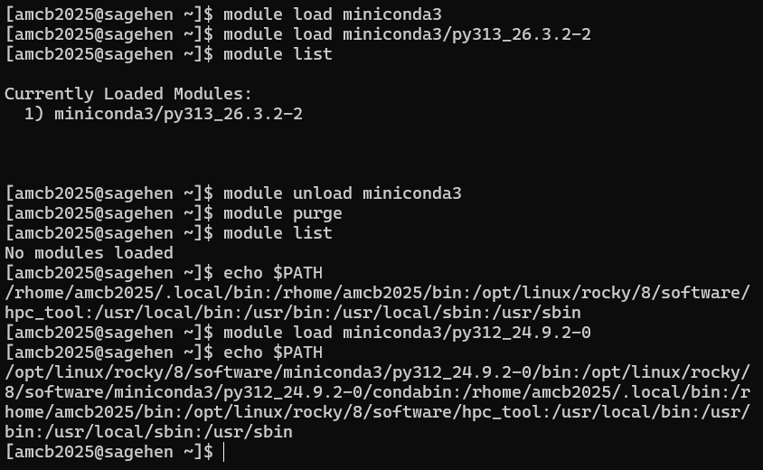

:::::::::::::::::::::::::::::::::::::: questions

- Why can't I just use any software on Sagehen?
- What is the module system?
- How do I find, load, and unload software modules?
- What if I need software that's not installed?

::::::::::::::::::::::::::::::::::::::::::::::

::::::::::::::::::::::::::::::::::::: objectives

- Understand why HPC clusters use module systems
- Search for available software with `module avail`
- Load and unload modules for your work
- Manage module dependencies and version conflicts
- Know how to request new software installations

:::::::::::::::::::::::::::::::::::::::::::::::

## Why Modules? The Problem They Solve

On a personal computer, you install software globally. On a shared cluster with hundreds of researchers, this creates conflicts:

- Alice needs Python 3.8; Bob needs Python 3.11; Charlie needs Python 2.7
- Package A needs Library X version 2.0; Package B needs version 3.0
- Some code compiles best with GCC 9; other code needs GCC 11

A **module system** allows users to load and unload software dynamically, so multiple versions coexist without conflict.

## Lmod: Sagehen's Module Manager

Sagehen uses **Lmod** with 90+ pre-installed modules covering programming languages, compilers, scientific libraries, bioinformatics tools, and more.

### Viewing Available Modules

```bash
# List all available modules
module avail

# Search for a specific module
module avail miniconda3

# Show module details without loading
module show miniconda3/py313_26.3.2-2
```

{alt='Terminal output of module avail on Sagehen showing a long multi-column list of software modules under /opt/linux/rocky/8/modulefile, including anaconda3, cuda, matlab, openmpi, r, and three miniconda3 versions with py313_26.3.2-2 marked as the default.'}

### Loading and Unloading Modules

```bash
# Load default Python
module load miniconda3

# Load a specific version
module load miniconda3/py313_26.3.2-2

# Load multiple modules at once (check `module avail` for the exact
# names and versions installed on Sagehen)
module load miniconda3/py313_26.3.2-2

# Check what's loaded
module list

# Unload a specific module
module unload miniconda3

# Unload all modules
module purge
```

### What Happens When You Load a Module

Loading a module modifies environment variables (`PATH`, `LD_LIBRARY_PATH`, etc.) so the system finds the right software executables and libraries:

```bash
# Before loading python
echo $PATH
# /usr/local/bin:/usr/bin:/bin:...

module load miniconda3/py313_26.3.2-2

# After loading python
echo $PATH
# /opt/linux/rocky/8/software/miniconda3/py313_26.3.2-2/bin:...
```

{alt='A terminal transcript comparing echo PATH before and after module load. After loading miniconda3/py313_26.3.2-2, PATH begins with that module's bin and condabin directories under /opt/linux/rocky/8/software.'}

### Module Families and Conflicts

Some modules belong to the same **family**. Loading one auto-unloads the other:

```bash
# Loading a second version of the same package auto-swaps it
module load cuda/11.8.0
module load cuda/12.2.1
# Lmod reports the swap: cuda/11.8.0 => cuda/12.2.1
```

The same applies to Python versions -- only one can be active at a time.

::::::::::::::::::::::::::::::::::::::: callout

## Good Practice: Start Fresh

Always start your job scripts with no modules loaded:

```bash
#!/bin/bash
#SBATCH ...

# Always start fresh
module purge
module load miniconda3/py313_26.3.2-2

python my_analysis.py
```

This ensures reproducible results regardless of what was loaded interactively.

:::::::::::::::::::::::::::::::::::::::::::::::

## Requesting New Software

If you need software that's not installed:

1. **Email its-hpc@pomona.edu** with software name, version, use case, and documentation link
2. Include your username and how many people would use it
3. Expected response: within a few business days

### Self-Install Alternative

You can install software in your home directory if needed:

```bash
mkdir -p ~/software
cd ~/software
# Download, configure, build with --prefix=~/software/
export PATH=~/software/bin:$PATH
```

::::::::::::::::::::::::::::::::::::: challenge

## Challenge 1: Loading and Switching Modules

Practice loading, switching, and purging modules.

**Steps**:

1. Load default Python: `module load miniconda3`
2. Check the version: `python --version`
3. Switch to a different version:
   ```bash
   module unload miniconda3
   module load miniconda3/py312_24.9.2-0
   python --version
   ```
4. List loaded modules: `module list`
5. Purge and reload:
   ```bash
   module purge
   module load miniconda3/py313_26.3.2-2
   python --version
   module list
   ```

**Questions**:

- Which version loaded by default?
- What happens after `module purge`?
- Can you have two Python versions loaded at once?

:::::::::::::::::::::::: solution

## Solution

- The default `module load miniconda3` loads the most recent stable version
- `module purge` removes all loaded modules; `module list` shows nothing
- No, loading a second Python version auto-unloads the first (same module family)

This demonstrates Lmod's ability to manage multiple versions cleanly.

{alt='Terminal transcript of an Lmod session. module list shows miniconda3/py313_26.3.2-2 as the only loaded module; after module purge, module list reports no modules loaded; the user then loads miniconda3/py312_24.9.2-0 and echo PATH shows that version's bin directory first.'}

:::::::::::::::::::::::::::::::::::::
:::::::::::::::::::::::::::::::::::::

:::::::::::::::::::::::::::::::::::::::: keypoints

- The module system solves software version conflicts on shared HPC clusters
- Sagehen uses Lmod with 90+ pre-installed packages
- Use `module avail` to search, `module load` to activate, `module purge` to reset
- Only one version of each module family can be loaded at a time
- Always use `module purge` at the start of job scripts for reproducibility
- Request new software at its-hpc@pomona.edu

::::::::::::::::::::::::::::::::::::::::::::::
