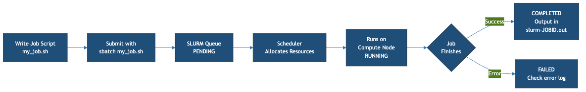

:::::::::::::::::::::::::::::::::::::: questions

- What is a batch script?
- How do I submit a job to Sagehen HPC?
- How do I monitor my job and retrieve output?

::::::::::::::::::::::::::::::::::::::::::::::

::::::::::::::::::::::::::::::::::::: objectives

- Understand the difference between interactive and batch jobs
- Write a simple SLURM batch script
- Submit jobs with `sbatch` and monitor with `squeue` and `sacct`
- Retrieve and interpret job output
- Troubleshoot common job submission issues

:::::::::::::::::::::::::::::::::::::::::::::::

## Batch Jobs vs. Interactive Jobs

### Batch Jobs (Most Common)

Scripts that SLURM runs when resources become available. You submit once and check results later.

- No need to stay logged in while job runs
- Reproducible: same script produces same results
- Can run for days or weeks

### Interactive Jobs

Give you a terminal on a compute node for direct command execution.

- Immediate feedback; great for debugging
- Must stay connected (job dies if you disconnect)
- Use for testing and development only

## Anatomy of a SLURM Batch Script

The script below is an **illustration to read, not to run** -- we'll walk through
what each line means. You'll write and submit your own working script in the
challenge at the end of this episode.

```bash
#!/bin/bash
#SBATCH --job-name=hello_hpc
#SBATCH --partition=short
#SBATCH --time=00:10:00
#SBATCH --ntasks=1
#SBATCH --cpus-per-task=1
#SBATCH --mem=1G
#SBATCH --output=%j_output.log

module purge
module load miniconda3/py313_26.3.2-2

echo "Host: $(hostname)"
echo "Job ID: $SLURM_JOB_ID"
echo "Start time: $(date)"

python -c "print('Hello from Sagehen!')"

echo "End time: $(date)"
```

This first-job example uses the `short` partition because it's a quick test. For production jobs longer than the `short` walltime limit, use `--partition=amd`.

### Key SBATCH Directives

| Directive | Purpose | Example |
|-----------|---------|---------|
| `--job-name` | Human-readable name | `hello_hpc` |
| `--partition` | Which partition | `amd`, `gpu`, `short` |
| `--time` | Maximum runtime | `HH:MM:SS` or `D-HH:MM:SS` |
| `--ntasks` | Number of tasks | `1` (usually) |
| `--cpus-per-task` | Cores per task | `1` to `128` |
| `--mem` | Memory per job | `1G`, `100G`, `500M` |
| `--output` | Output file (`%j` = job ID) | `%j_output.log` |
| `--gres` | GPU request | `gpu:1`, `gpu:2` |

## Submitting and Monitoring

{alt='Flow diagram of the SLURM job workflow. Write a job script my_job.sh, submit it with sbatch, the job waits in the SLURM queue as PENDING, the scheduler allocates resources, the job runs on a compute node as RUNNING, and when the job finishes it is either COMPLETED with output in slurm-JOBID.out or FAILED, in which case you check the error log.'}

### Submit with sbatch

```bash
sbatch ~/workshop-0/first_job.sh
# Output: Submitted batch job 12345
```

After submission, SLURM queues the job, allocates resources when available, runs your script, and writes output to the specified file. You can log out while it runs.

### Monitor with squeue

```bash
# Check your current jobs
squeue -u $USER

# Check a specific job
squeue -j 12345
```

Status codes: `R` = Running, `PD` = Pending, `CA` = Cancelled, `CD` = Completed.

### Check History with sacct

```bash
# See completed jobs
sacct -u $USER --format=JobID,JobName,State,Elapsed,MaxRSS
```

### Retrieve Output

```bash
# View your job output
cat ~/workshop-0/12345_output.log
```

## Common Resource Patterns

```bash
# Quick test (2 minutes, short partition)
#SBATCH --partition=short
#SBATCH --time=00:02:00
#SBATCH --cpus-per-task=1
#SBATCH --mem=500M

# Standard CPU job (8 hours)
#SBATCH --partition=amd
#SBATCH --time=08:00:00
#SBATCH --cpus-per-task=32
#SBATCH --mem=100G

# GPU job (deep learning)
#SBATCH --partition=gpu
#SBATCH --time=72:00:00
#SBATCH --cpus-per-task=16
#SBATCH --mem=100G
#SBATCH --gres=gpu:2
```

## Troubleshooting

### Job Won't Start (Status: PD)

- Wait longer (resources might be occupied)
- Reduce resource requests
- Lower your `--time` request so the scheduler can back-fill your job sooner
- Check cluster status: `sinfo`

### Job Terminated Unexpectedly

```bash
sacct -j 12345
# TIMEOUT = increase --time
# OUT_OF_MEMORY = increase --mem
# FAILED = check output for script errors
```

::::::::::::::::::::::::::::::::::::::: callout

## Best Practices for Job Scripts

1. Always use `module purge` at the start
2. Be specific with resource requests (don't over-request)
3. Add comments explaining what your job does
4. Include echo statements so you can see what happened
5. Test on the `short` partition before launching long production runs on `amd` or `gpu`

:::::::::::::::::::::::::::::::::::::::::::::::

::::::::::::::::::::::::::::::::::::: challenge

## Challenge 1: Submit Your First Job

Create and submit a batch job that runs a Python computation.

**Steps**:

1. Move into your workshop directory (job output lands in the directory you
   submit from):

   ```bash
   cd ~/workshop-0
   ```
2. Create the Python script:
   ```bash
   cat > ~/workshop-0/fibonacci.py << 'EOF'
   def fibonacci(n):
       if n <= 1:
           return n
       a, b = 0, 1
       for _ in range(2, n + 1):
           a, b = b, a + b
       return b

   for i in range(1, 21):
       print(f"Fibonacci({i}) = {fibonacci(i)}")
   EOF
   ```
3. Create the batch script:
   ```bash
   cat > ~/workshop-0/fib_job.sh << 'EOF'
   #!/bin/bash
   #SBATCH --job-name=fibonacci
   #SBATCH --partition=short
   #SBATCH --time=00:05:00
   #SBATCH --ntasks=1
   #SBATCH --cpus-per-task=1
   #SBATCH --mem=1G
   #SBATCH --output=%j_fib.log

   module purge
   module load miniconda3/py313_26.3.2-2

   echo "Running Fibonacci calculation..."
   python ~/workshop-0/fibonacci.py
   echo "Done!"
   EOF
   ```
4. Submit: `sbatch fib_job.sh`
5. Monitor: `squeue -u $USER`
6. View output: `cat ~/workshop-0/*_fib.log`

**Question**: What is Fibonacci(20)?

:::::::::::::::::::::::: solution

## Solution

Fibonacci(20) = 6765

The job should complete in seconds. Check with `sacct -j JOBID` and view the log file to confirm all Fibonacci numbers were printed.

{alt='Terminal transcript of sbatch submitting a batch job, an squeue listing with headers but no rows because the job already completed, and the log file contents listing Fibonacci values 1 through 20, ending with 6765 and Done.'}

:::::::::::::::::::::::::::::::::::::
:::::::::::::::::::::::::::::::::::::

:::::::::::::::::::::::::::::::::::::::: keypoints

- Batch jobs are scripts submitted with `sbatch`; they run when resources are available
- Every batch script needs `#!/bin/bash` and SBATCH directives for resources
- Key directives: --partition, --time, --cpus-per-task, --mem, --output
- Monitor jobs with `squeue -u $USER` (running) or `sacct` (history)
- Always use `module purge` in job scripts for reproducibility
- Test on the `short` partition before submitting long production jobs to `amd` or `gpu`
- Common failures: TIMEOUT (increase --time), OUT_OF_MEMORY (increase --mem)

::::::::::::::::::::::::::::::::::::::::::::::
