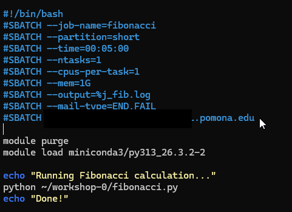
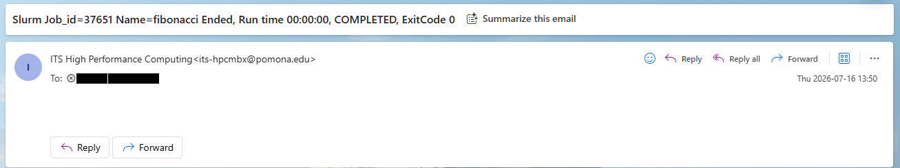

:::::::::::::::::::::::::::::::::::::: questions

- What other workshops are available?
- Where do I go for help?
- How do I handle more complex job patterns?

::::::::::::::::::::::::::::::::::::::::::::::

::::::::::::::::::::::::::::::::::::: objectives

- Know where to find additional HPC training resources
- Understand common next-step workflows beyond basic job submission
- Know how to get help from the HPC team

:::::::::::::::::::::::::::::::::::::::::::::::

## Beyond Your First Job

Now that you can connect, navigate files, load modules, and submit jobs, here are common next steps:

### Interactive Jobs for Development

Use `srun` for interactive sessions on compute nodes:

```bash
srun --partition=short --time=01:00:00 --cpus-per-task=4 --mem=8G --pty bash
```

This gives you a bash shell on a compute node where you can test code interactively without running on the head node.

{alt='A long terminal transcript. The batch script is shown with cat, an srun command with a ten-minute limit opens an interactive shell and the prompt changes to node a001, sbatch submits the job from there, ls shows the numbered log file, cat prints Fibonacci 1 through 20 ending in 6765 and Done, and exit returns to the head node prompt.'}

### Email Notifications

Get notified when your job finishes:

```bash
#SBATCH --mail-type=END,FAIL
#SBATCH --mail-user=username@pomona.edu
```

{alt='A syntax-highlighted batch script in a text editor. The SBATCH header for the fibonacci job on the short partition now includes mail-type END,FAIL and a mail-user line, above the module purge and miniconda3 load lines and the python command.'}

{alt='An email client showing a message from ITS High Performance Computing. The subject reads Slurm Job_id 37651, Name fibonacci, Ended, Run time zero seconds, COMPLETED, Exit Code 0. The message body is empty.'}

### Customizing Your Shell

Edit `~/.bashrc` to set up your environment on every login:

```bash
nano ~/.bashrc
```

Useful additions:
```bash
# Helpful aliases
alias ll='ls -lah'
alias sq='squeue -u $USER'
alias sa='sacct -u $USER'

# Set your default editor
export EDITOR=nano
```

Reload with `source ~/.bashrc`.

## Additional Workshop Topics

The Pomona College HPC Workshop Series covers many advanced topics:

- **SLURM Job Scheduling**: Advanced batch scripting, job arrays, dependencies, GPU workflows
- **Data Transfer and Management**: Moving data to/from Sagehen with scp, rsync, Globus
- **Security and Access**: SSH keys, data classification, encrypted storage
- **OnDemand Portal**: Graphical access, Jupyter, RStudio on the cluster
- **Domain-Specific Workshops**: R, Python, bioinformatics, and more

## Getting Help

### HPC Support

- **Email**: its-hpc@pomona.edu
- **Include in your email**:
  - Your username
  - Job ID (if applicable)
  - Error messages or output
  - What you expected vs. what happened

### Common Self-Help Commands

```bash
# Check cluster status
sinfo

# Check your running/pending jobs
squeue -u $USER

# Check completed job details
sacct -j JOBID --format=JobID,JobName,State,Elapsed,MaxRSS

# Check your storage quota
quota_check.sh

# See what modules are loaded
module list
```

::::::::::::::::::::::::::::::::::::::: callout

## Quick Reference Card

| Task | Command |
|------|---------|
| Connect | `ssh <myusername>@sagehen.hpc.pomona.edu` |
| Submit job | `sbatch script.sh` |
| Check jobs | `squeue -u $USER` |
| Job history | `sacct -u $USER` |
| Cancel job | `scancel JOBID` |
| Cluster status | `sinfo` |
| Load software | `module load package` |
| Reset modules | `module purge` |
| Check quota | `quota_check.sh` |
| OnDemand | https://ondemand.hpc.pomona.edu |

:::::::::::::::::::::::::::::::::::::::::::::::

::::::::::::::::::::::::::::::::::::: challenge

## Challenge 1: Plan Your First Real Project

Think about a research computation you want to run on Sagehen. Write down a plan covering:

1. What software/modules do you need?
2. How much memory and how many cores?
3. How long will it take?
4. Which partition should you use?
5. What input data do you need to upload?
6. Where should output be saved?

Draft a skeleton batch script for this project (just the SBATCH headers and module loads; the actual command can be a placeholder).

:::::::::::::::::::::::: solution

## Solution

A good plan should include:

```bash
#!/bin/bash
#SBATCH --job-name=my_research
#SBATCH --partition=amd          # or `gpu` for GPU jobs, `short` for quick tests
#SBATCH --time=08:00:00          # realistic estimate
#SBATCH --cpus-per-task=16       # based on your code's parallelism
#SBATCH --mem=64G                # based on data size
#SBATCH --output=%j_output.log

module purge
module load miniconda3/py313_26.3.2-2   # or whatever you need (check module avail)

# Your research command here
python my_analysis.py --input /bigdata/lab/<labname>/data --output ~/results/
```

Key considerations:
- Start with a short test on the `short` partition (small `--time`, e.g., 10–30 minutes) before launching production work on `amd` or `gpu`
- Scale up resources once you know what your code needs
- Save important output to `/rhome` or `/bigdata`, not `/scratch`

:::::::::::::::::::::::::::::::::::::
:::::::::::::::::::::::::::::::::::::

:::::::::::::::::::::::::::::::::::::::: keypoints

- Use `srun --pty bash` for interactive compute sessions instead of running on the head node
- Email notifications keep you informed about job completion and failures
- Customize `~/.bashrc` for a more productive login environment
- Additional workshops cover SLURM advanced features, data transfer, security, and more
- Contact its-hpc@pomona.edu for help; include your username, job ID, and error messages
- Use `quota_check.sh` (not `du`) to check BeeGFS storage usage

::::::::::::::::::::::::::::::::::::::::::::::

<!-- highlight <labname>/<myusername> placeholders in code blocks; remove if the varnish theme handles this natively -->
<script>(function(){var CSS='.sh-placeholder{color:#c2410c;font-weight:700}[data-bs-theme="dark"] .sh-placeholder,html.dark .sh-placeholder{color:#fdba74}@media (prefers-color-scheme: dark){[data-bs-theme="auto"] .sh-placeholder{color:#fdba74}}';var RX=/<labname>|<myusername>/g;function firstMatch(el){var w=document.createTreeWalker(el,NodeFilter.SHOW_TEXT,null),nodes=[],full='';while(w.nextNode()){nodes.push({n:w.currentNode,s:full.length});full+=w.currentNode.nodeValue;}RX.lastIndex=0;var m;while((m=RX.exec(full))){var s=m.index,e=s+m[0].length,inSpan=false,parts=[];for(var j=0;j<nodes.length;j++){var ns=nodes[j].s,ne=ns+nodes[j].n.nodeValue.length;if(ne<=s||ns>=e)continue;parts.push({node:nodes[j].n,a:Math.max(s-ns,0),b:Math.min(e-ns,nodes[j].n.nodeValue.length)});var p=nodes[j].n.parentNode;while(p&&p!==el){if(p.classList&&p.classList.contains('sh-placeholder')){inSpan=true;break;}p=p.parentNode;}}if(!inSpan&&parts.length)return parts;}return null;}function wrapParts(parts){for(var i=parts.length-1;i>=0;i--){var t=parts[i].node,txt=t.nodeValue,a=parts[i].a,b=parts[i].b;var span=document.createElement('span');span.className='sh-placeholder';span.textContent=txt.slice(a,b);var f=document.createDocumentFragment();if(a>0)f.appendChild(document.createTextNode(txt.slice(0,a)));f.appendChild(span);if(b<txt.length)f.appendChild(document.createTextNode(txt.slice(b)));t.parentNode.replaceChild(f,t);}}function run(){var st=document.createElement('style');st.textContent=CSS;document.head.appendChild(st);document.querySelectorAll('pre,code').forEach(function(el){var guard=0,parts;while((parts=firstMatch(el))&&guard++<500){wrapParts(parts);}});}if(document.readyState==='loading'){document.addEventListener('DOMContentLoaded',run);}else{run();}})();</script>
